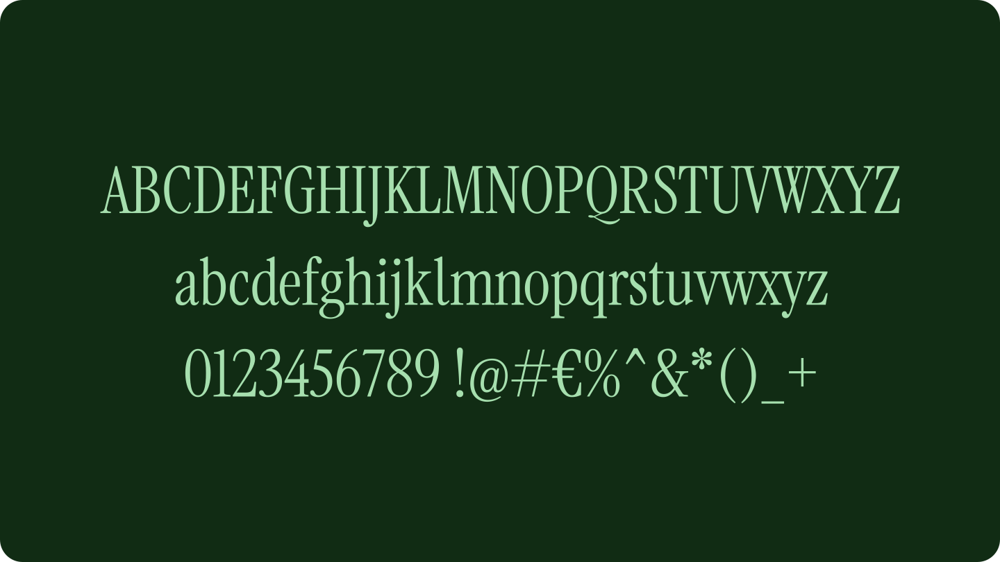
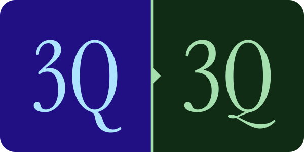

# MN Celesta 

A sharp display serif adapted from the lovely [Instrument Serif](https://github.com/Instrument/instrument-serif) font to match my own preferences. Still work in progress.

## Changes.

### Sharper.
The main difference between Instrument Serif and MN Celesta is that Celesta isn't as soft. The serifs are pointier, corners are more angular and bumps in the likes of `Z` and `7` have been flattened.

&nbsp;

### Stubbier.
The terminals found in glyphs like `a`, `d` and `t` have been changed to be a little stubbier and not go straight up, similar to the ss01 stylistic set of Instrument Serif. The `l` has also received this hook.

&nbsp;

### Subjectively sleeker.
The balance of certain glyphs like `B` and `3` has been adjusted to make them less bottom-heavy. Other glyphs have been changed more noticeably, such as the `Q` which got a new tail at the bottom.

&nbsp;

## Language support.

The 374 Latin glyphs that make up this font support 86 languages:

Afrikaans, Albanian, Asu, Basque, Bemba, Bena, Breton, Catalan, Chiga, Colognian, Cornish, Croatian, Czech, Danish, Dutch, English, Estonian, Faroese, Filipino, Finnish, French, Friulian, Galician, Ganda, German, Gusii, Hungarian, Inari Sami, Indonesian, Irish, Italian, Jola-Fonyi, Kabuverdianu, Kalenjin, Kinyarwanda, Latvian, Lithuanian, Lower Sorbian, Luo, Luxembourgish, Luyia, Machame, Makhuwa-Meetto, Makonde, Malagasy, Maltese, Manx, Morisyen, North Ndebele, Norwegian Bokmål, Norwegian Nynorsk, Nyankole, Oromo, Polish, Portuguese, Quechua, Romanian, Romansh, Rombo, Rundi, Rwa, Samburu, Sango, Sangu, Scottish Gaelic, Sena, Serbian, Shambala, Shona, Slovak, Soga, Somali, Spanish, Swahili, Swedish, Swiss German, Taita, Teso, Turkish, Upper Sorbian, Uzbek (Latin), Volapük, Vunjo, Welsh, Western Frisian, Zulu.

## Acknowledgements.

Instrument Serif was designed by [Rodrigo Fuenzalida](https://rfuenzalida.com) with direction from [Jordan Egstad](https://egstad.com), [JD Hooge](http://jdhooge.com/), and [Jack De Caluwé](https://jackdecaluwe.com/) on behalf of [Instrument](https://instrument.com).

Deletion and moving of some small dots in Glyphs done by [yours truly](https://pprmint.de).

## License.

This Font Software is licensed under the SIL Open Font License, Version 1.1. This license is available with a FAQ at: https://scripts.sil.org/OFL
